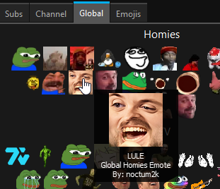
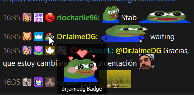

<u>**Chatterino Homies**</u>

Chatterino Homies is a fork of Chatterino. This fork mainly contains features that aren't accepted into Chatterino and Chatterino 7.

### Screenshots




### Downloads

Current releases are available at [https://chatterinohomies.com](https://chatterinohomies.com).

### Issues

If you have issues such as crashes or weird behaviour regarding this fork, report them [in the issue-section](https://github.com/itzAlex/chatterino7/issues). If you have issues with other features, please report them [in the upstream issue-section](https://github.com/Chatterino/chatterino2/issues).

### Discord

If you don't have a GitHub account and want to report issues or want to join the community you can join the official Homies Discord using the link here: <https://discord.gg/ZPxUUzDjbM>.

## Original Chatterino 2 Readme

Chatterino 2 is a chat client for [Twitch.tv](https://twitch.tv).
The Chatterino 2 wiki can be found [here](https://wiki.chatterino.com).
Contribution guidelines can be found [here](https://wiki.chatterino.com/Contributing%20for%20Developers).

## Building

- [Building on Windows](../master/BUILDING_ON_WINDOWS.md)
- [Building on Windows with vcpkg](../master/BUILDING_ON_WINDOWS_WITH_VCPKG.md)
- [Building on Linux](../master/BUILDING_ON_LINUX.md)
- [Building on macOS](../master/BUILDING_ON_MAC.md)
- [Building on FreeBSD](../master/BUILDING_ON_FREEBSD.md)

## Git blame

This project has big commits in the history which touch most files while only doing stylistic changes. To improve the output of git-blame, consider setting:

```shell
git config blame.ignoreRevsFile .git-blame-ignore-revs
```

This will ignore all revisions mentioned in the [`.git-blame-ignore-revs`
file](./.git-blame-ignore-revs). GitHub does this by default.

## Code style

The code is formatted using [clang-format](https://clang.llvm.org/docs/ClangFormat.html). Our configuration is found in the [.clang-format](.clang-format) file in the repository root directory.

For more contribution guidelines, take a look at [the wiki](https://wiki.chatterino.com/Contributing%20for%20Developers/).

## Doxygen

Doxygen is used to generate project information daily and is available [here](https://doxygen.chatterino.com).
